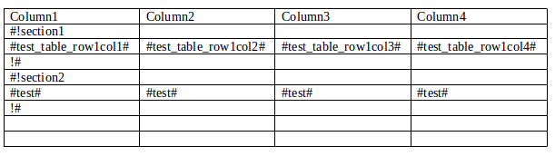

==================================
Работа с отчетами в формате `docx`
==================================

Вставка рисунков (версия 1.3.6.1)
=================================

Для вставки рисунков в форматах `jpg`, `png` и `gif` необходимо использовать
класс DocxImage. Теги для вставки рисунков должны быть обрамлены символами `#`.
Параметры `width` и `height` задают ширину и высоту рисунка в сантиметрах

Код вставки рисунков
--------------------

.. code-block:: python

    from simple_report.docx.drawing import DocxImage
    from simple_report.report import DocumentReport

    report = DocumentReport('test.docx')
    dst = 'result.docx'
    params = {
        'image': DocxImage('/home/user/image.png', width=3, height=2),
        'text': u'Тестовый комментарий'
    }

    report.build(dst, params=params)

Таблицы в отчетах DOCX
======================

Секции в таблицах DOCX состоят из строк. Отделяются следующим образом:
перед строками, которые нужно использовать как основу секции, добавляется строка,
в 1 колонке которой должен быть текст '#!section_name', где `section_name` -
идентификатор секции. После секции идет строка, в 1 колонке которой стоит текст
'!#'. В итоге таблицы можно наращивать в высоту.
В таблицах DOCX также можно вставлять рисунки, начиная с версии 1.3.6.1

Пример шаблона с таблицей
-------------------------

.. code-block:: python

    template_name = 'test_table.docx'
    res_file_name = 'res-table_flush.docx'

    report = DocumentReport(path)

    s1 = report.get_section('section1')
    s2 = report.get_section('section2')
    s2.flush({'test': u'Lorem ipsum'})
    s1.flush({
        'test_table_row1col1': u'Hello',
        'test_table_row1col2': u'simple_report',
        'test_table_row1col3': u'user',
        'test_table_row1col4': LOREM_IPSUM,
    })
    params = {}
    report.build(dst, params)
