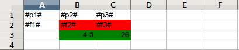
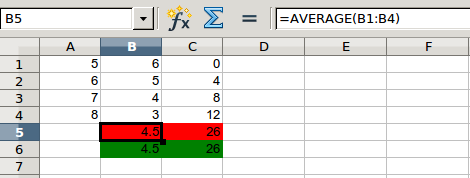

==========================================
Работа с отчетами в форматах `xls`, `xlsx`
==========================================

Использование формул
====================

Шаблон
------

Код вставки формул
------------------

.. code-block:: python

    import os
    import unittest
    from simple_report.converter.abstract import FileConverter
    from simple_report.utils import FormulaWriteExcel
    from simple_report.report import (
        SpreadsheetReport
    )
    from simple_report.xls.document import DocumentXLS

    def insert_formulas(row_insert_formula_section, check_insert_formula_section):
        """Хелпер для вставки формул"""
        for j in range(4):
            row_insert_formula_section.flush(
                {'p1': 5 + j, 'p2': 6 - j, 'p3': 4 * j},
                used_formulas={'p1': ['p1', 't1'], 'p2': ['p2']}
            )
        check_insert_formula_section.flush(
            {
                'f2': FormulaWriteExcel('p2', 'AVERAGE', True),
                'f3': FormulaWriteExcel('p1', 'SUM', False)
            },
            oriented=ISpreadsheetSection.VERTICAL
        )

    class TestReportFormatXLS(unittest.TestCase):
        """
        Тест на работоспособность отчета формата XLS
        """

        SUBDIR = 'linux'

        def setUp(self):
            assert self.SUBDIR
            self.src_dir = os.path.join(
                os.path.dirname(os.path.abspath(__file__)),
                'test_data',
                self.SUBDIR,
                'xls'
            )
            self.dst_dir = self.src_dir

            self.test_files = dict([(path, os.path.join(self.src_dir, path))
                                    for path in os.listdir(self.src_dir)
                                    if path.startswith('test')])

        def test_xls_formula_generation(self):
            """
            Генерация формул в xls
            """
            src = self.test_files['test-formula_generation.xls']
            dst = os.path.join(self.dst_dir, 'res-formula_generation.xls')
            if os.path.exists(dst):
                os.remove(dst)

            report = SpreadsheetReport(src, wrapper=DocumentXLS,
                                       type=FileConverter.XLS)

            row_insert_formula_section = report.get_section('row_insert_formula')
            check_insert_formula_section = report.get_section(
                'check_insert_formula'
            )

            insert_formulas(row_insert_formula_section,
                           check_insert_formula_section)
            report.build(dst)

Основную работу здесь делает класс `FormulaWriteExcel` совместно с параметром
`used_formulas` метода `flush` секции

Выходной файл с формулами
-------------------------

Слияние ячеек
=============
