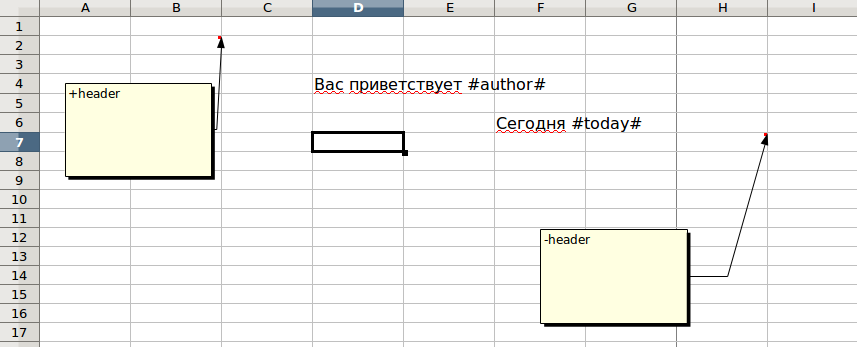
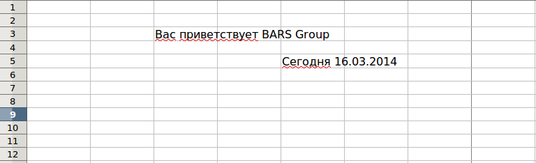
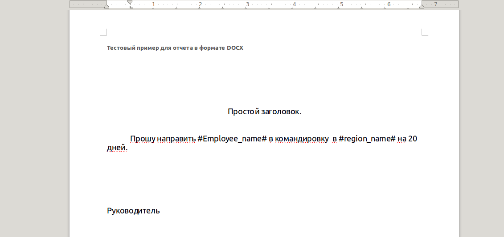
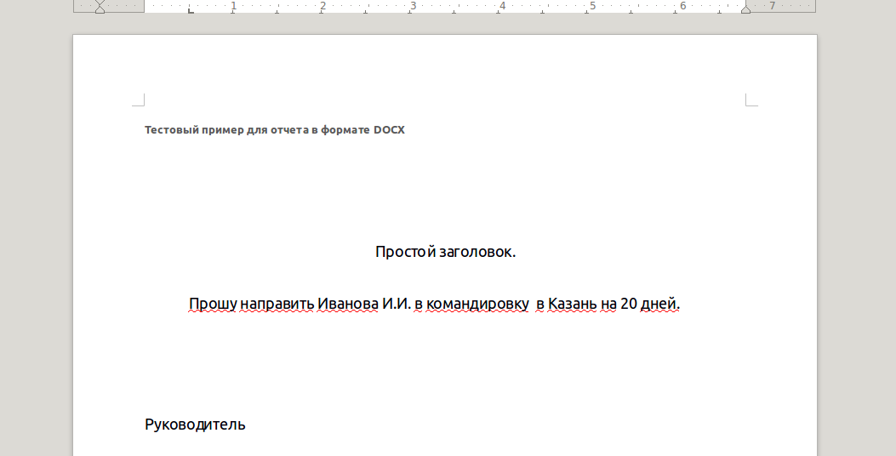

=============================
Простые примеры использования
=============================

Отчеты в форматах `xslx` и `xls`
================================

Пример шаблона
--------------

В данном простом примере видны секции - прямоугольные области,
которые отделены комментариями вида +text и -text.
Здесь text может быть любым словом из букв латинского алфавита,
символов подчеркивания и цифр

Пример кода
-----------

.. code-block:: python

    from simple_report.report import SpreadsheetReport
    from simple_report.utils import FormulaWriteExcel
    from simple_report.xls.document import DocumentXLS
    from simple_report.xlsx.document import DocumentXLSX

    path_to_template = '/home/user/test_simple.xlsx'

    # В самом простом варианте нужно указать путь до шаблона `xlsx`
    report = SpreadsheetReport(
        path_to_template
    )
    header_section = report.get_section('header')
    header_section.flush({
        'author': u'BARS Group',
        'today': datetime.date.today()
    })
    dst = 'result_simple.xlsx'
    report.build(dst)

Все просто - указываем путь до шаблона, получаем секцию по имени,
передавая в метод секции `flush` словарь со значениями для подстановки,
завершаем создание отчета вызовом метода `build` отчета

Пример выходного файла
----------------------

Отчеты в формате `docx`
=======================

Пример шаблона
--------------

Пример кода
-----------

.. code-block:: python

    class TestLinuxDOCX(unittest.TestCase):

        def setUp(self):
            self.src_dir = os.path.join(
                os.path.dirname(os.path.abspath(__file__)),
                'test_data',
                'linux',
                'docx'
            )
            self.dst_dir = self.src_dir

            self.test_files = dict([(path, os.path.join(self.src_dir, path))
                                    for path in os.listdir(self.src_dir)
                                    if path.startswith('test')])
        def test_simple_docx(self):
            template_name = 'test-sluzh.docx'
            path = self.test_files[template_name]
            doc = DocumentReport(path)

            res_file_name = 'res-' + template_name
            dst = os.path.join(self.dst_dir, res_file_name)

            doc.build(dst, {'Employee_name': u'Иванова И.И.',
                            'region_name': u'Казань'})
            self.assertEqual(os.path.exists(dst), True)

Пример выходного файла
----------------------

